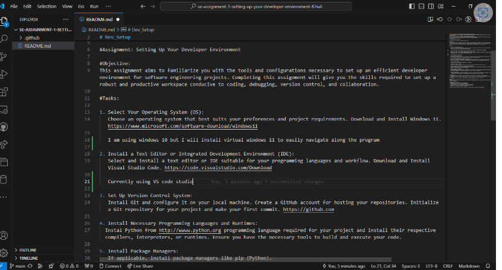
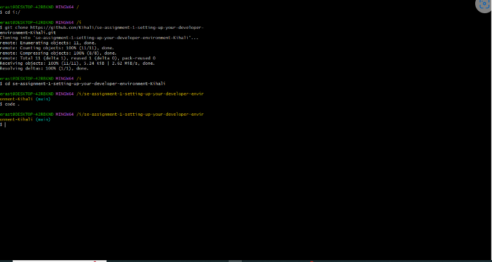
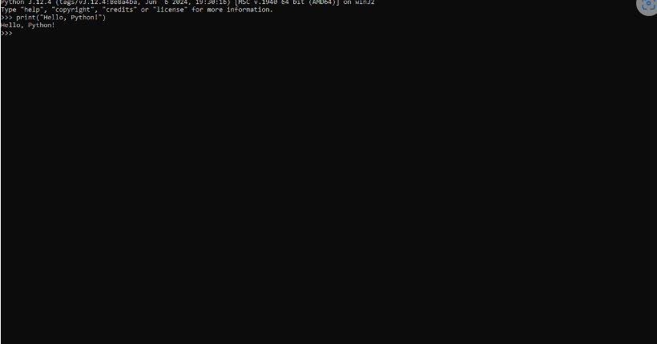
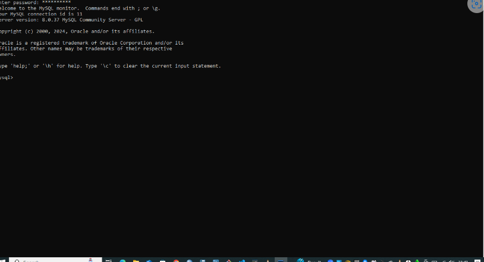

# Dev_Setup
Setup Development Environment

#Assignment: Setting Up Your Developer Environment

#Objective:
This assignment aims to familiarize you with the tools and configurations necessary to set up an efficient developer environment for software engineering projects. Completing this assignment will give you the skills required to set up a robust and productive workspace conducive to coding, debugging, version control, and collaboration.

#Tasks:

1. Select Your Operating System (OS):
   Choose an operating system that best suits your preferences and project requirements. Download and Install Windows 11. https://www.microsoft.com/software-download/windows11
   Assess Your Requirements Compatibility Check: Ensure your current hardware meets the minimum requirements for Windows 11. Check for compatibility using Microsoft's PC Health Check tool or refer to the official system requirements on Microsoft's website. 2. Download Windows 11 Visit Microsoft's Official Website:

Go to Microsoft's Windows 11 download page. Download Tool:

Click on the "Download now" button to download the Windows 11 Installation Assistant. 3. Create Installation Media Run the Installation Assistant:

Once downloaded, run the Windows 11 Installation Assistant. Accept Terms:

Read and accept the license terms. Choose Upgrade Option:

Select "Upgrade this PC now" if you want to upgrade your current Windows installation to Windows 11. Alternatively, you can choose to create installation media (USB flash drive or ISO file) for another PC. Follow Prompts:

Follow the prompts on the screen to proceed with the installation process. 4. Install Windows 11 Start Installation:

If upgrading, the assistant will download Windows 11 and start the installation process. Configure Settings:

During the installation, configure settings such as language, time, and keyboard input. Wait for Completion:

The installation process may take some time. Your computer will restart several times. 5. Set Up Windows 11 Initial Setup:

After installation completes, follow the on-screen instructions to set up Windows 11. Account Setup:

Create or sign in with your Microsoft account. Customize Settings:

Customize privacy, security, and other settings according to your preferences. 6. Install Drivers and Updates Check for Updates:

After setting up, go to Settings > Update & Security > Windows Update to check for and install any available updates. Install Device Drivers:

Download and install the latest drivers for your hardware components from the manufacturers' websites to ensure optimal performance.

2. Install a Text Editor or Integrated Development Environment (IDE):
   Select and install a text editor or IDE suitable for your programming languages and workflow. Download and Install Visual Studio Code. https://code.visualstudio.com/Download
   Go to the Visual Studio Code download page using your web browser. Select Your Operating System:

Click on the "Windows" button to download the installer for Windows. 2. Downloading Visual Studio Code Download the Installer: Once you click on the "Windows" button, the download of the installer (VSCodeSetup.exe) should begin automatically. 3. Installing Visual Studio Code Run the Installer:

Once the download is complete, locate the downloaded VSCodeSetup.exe file in your Downloads folder or your browser's download list. Start Installation:

Double-click on VSCodeSetup.exe to start the installation process. User Account Control (UAC) Prompt:

If prompted by User Account Control, click Yes to allow the installer to make changes to your device. Choose Setup Options:

Follow the prompts in the installation wizard: Review the license agreement and click Next. Choose the destination folder where you want to install VS Code or leave it as the default and click Next. Select Additional Tasks:

Optionally, choose additional tasks such as creating a desktop icon or adding VS Code to the PATH variable. Then, click Next. Start Installation:

Click Install to begin the installation process. This may take a few moments depending on your system's speed. Complete the Installation:

Once the installation is complete, click Finish to exit the setup wizard. 4. Launching Visual Studio Code Launch VS Code: You can launch Visual Studio Code in several ways: Double-click the VS Code shortcut on the desktop (if you opted to create one during installation). Open the Start menu, find Visual Studio Code in the list of installed applications, and click on it. 5. Configuring Visual Studio Code Extensions:

Open VS Code and navigate to the Extensions view (Ctrl+Shift+X or Cmd+Shift+X). Install extensions relevant to your programming languages and workflow by searching for them and clicking Install. Settings:

Customize VS Code settings (e.g., font size, theme) through the File > Preferences menu or by editing settings.json. 6. Testing Your Installation Open a Project:

Open a folder containing your project files by selecting File > Open Folder in VS Code. Verify Functionality:

Write some code or open existing files to ensure syntax highlighting, code completion, and other features are working correctly.

Currently using VS code studio and below is a screenshot of how it looks in my pc

3. Set Up Version Control System:
   Install Git and configure it on your local machine. Create a GitHub account for hosting your repositories. Initialize a Git repository for your project and make your first commit. https://github.com
   Go to the Git download page using your web browser. Select Your Operating System:

Click on the Windows icon to download the latest version of Git for Windows. Run the Installer:

Once the download is complete, locate the downloaded .exe file (e.g., Git-2.XX.X-64-bit.exe) in your Downloads folder or your browser's download list. Start Installation:

Double-click on the .exe file to start the installation process. Setup Wizard:

Follow the prompts in the installation wizard: Click Next to proceed. Review the license agreement and click Next. Choose the destination folder where you want to install Git or leave it as the default and click Next. Select components to install (default selections are usually fine) and click Next. Choose the default editor used by Git (e.g., Nano, Vim, Notepad++) and click Next. Choose the default behavior of Git (e.g., adjusting your system's PATH environment) and click Next. Click Install to begin the installation process. Once the installation is complete, click Finish to exit the setup wizard. 2. Configuring Git Open Git Bash:

After installing Git, open Git Bash. You can find it in the Start menu or by searching for "Git Bash". Set Up Your Identity:

Configure your username and email address. Open Git Bash and run the following commands: bash Copy code git config --global user.name "Your Name" git config --global user.email "your.email@example.com" Replace "Your Name" with your actual name and "your.email@example.com" with the email address associated with your GitHub account. Check Configuration:

Verify your Git configuration: bash Copy code git config --global --list 3. Creating a GitHub Account Visit GitHub:

Go to GitHub using your web browser. Sign Up:

Click on Sign up and follow the prompts to create a new GitHub account. 4. Initializing a Git Repository Navigate to Your Project Folder:

Open File Explorer and navigate to the folder where your project files are located. Open Git Bash:

Right-click inside the folder (or use Shift + Right-click) and select Git Bash Here to open Git Bash in the current directory. Initialize Git Repository:

Inside Git Bash, initialize a new Git repository for your project: bash Copy code git init 5. Making Your First Commit Add Files:

Stage your files for committing. For example, to stage all files, use: bash Copy code git add . Commit Changes:

Commit the staged changes with a meaningful commit message: bash Copy code git commit -m "Initial commit" 6. Connecting to GitHub Create a New Repository on GitHub:

Log into your GitHub account. Click on the + icon in the top right corner and select New repository. Follow the prompts to create a new repository, optionally adding a README file or selecting a .gitignore template. Link Local Repository to GitHub Repository:

Follow the instructions provided on the GitHub repository page under the section …or push an existing repository from the command line: bash Copy code git remote add origin https://github.com/your-username/your-repository.git git branch -M main git push -u origin main Replace your-username with your GitHub username and your-repository with the name of your GitHub repository.

The program was installed successfully

4. Install Necessary Programming Languages and Runtimes:
  Instal Python from http://wwww.python.org programming language required for your project and install their respective compilers, interpreters, or runtimes. Ensure you have the necessary tools to build and execute your code.
Downloading Python Visit the Python Website:

Go to python.org using your web browser. Download Python Installer:

Click on the "Downloads" tab in the top menu. Choose the Python Version:

Select the version of Python you wish to install. It's recommended to choose the latest stable release unless your project specifically requires an older version. Select the Installer:

Scroll down to find the Windows installer section. Click on the link to download the installer suitable for your system (e.g., Windows installer (64-bit) for most modern systems). 2. Installing Python Run the Installer:

Once the download is complete, locate the downloaded .exe file (e.g., python-3.X.X-amd64.exe) in your Downloads folder or your browser's download list. Start Installation:

Double-click on the .exe file to start the Python installer. Setup Wizard:

Follow the prompts in the installation wizard: Select "Install Now" to install Python with default settings. Customize the installation by selecting "Customize installation" if desired (e.g., choosing the installation location, adding Python to PATH). Add Python to PATH (Optional):

To ensure Python is accessible from the command line, select the option "Add Python to PATH" during installation. This is recommended for ease of use. Complete the Installation:

Click Install to begin the installation process. Once the installation is complete, click Close to exit the setup wizard. 3. Verifying the Installation Open Command Prompt or PowerShell:

Open Command Prompt (cmd) or PowerShell (powershell) by searching for it in the Start menu. Check Python Version:

Type the following command to check that Python is installed correctly and to verify the version installed: bash Copy code python --version Alternatively, for Python 3.x, use: bash Copy code python3 --version 4. Installing Additional Tools (Optional) Python Package Manager (pip):

Python usually comes with pip, a package manager, installed by default. You can verify its version using: bash Copy code pip --version Integrated Development Environments (IDEs):

Consider installing an IDE such as Visual Studio Code (already covered in a previous response), PyCharm, or IDLE for a more integrated development experience. 5. Testing Python Installation Write a Simple Python Script:

Open a text editor (e.g., Notepad, Visual Studio Code) and write a simple Python script, for example: python Copy code print("Hello, Python!") Run the Python Script:

5. Install Package Managers:
   If applicable, install package managers like pip (Python).

6. Configure a Database (MySQL):
   Download and install MySQL database. https://dev.mysql.com/downloads/windows/installer/5.7.html
Go to MySQL Installer for Windows using your web browser. Download MySQL Installer:

Scroll down to find the download options for MySQL Installer. Choose the appropriate installer based on your system architecture (typically 64-bit). 2. Run MySQL Installer Open the Installer:

Once the download is complete, locate the downloaded installer file (e.g., mysql-installer-web-community-5.X.X.X.msi) in your Downloads folder or browser's download list. Start Installation:

Double-click on the installer file to start the MySQL Installer setup. Choose Setup Type:

Select "Developer Default" or "Server only" setup type based on your requirements. The Developer Default includes MySQL Server, MySQL Workbench, connectors, and other useful tools. Download and Install:

The installer will download the necessary components based on your selection. Follow the prompts in the MySQL Installer wizard to proceed with the installation. 3. MySQL Server Configuration Configuration:

During installation, you will be prompted to configure MySQL Server. Set a root password for MySQL Server. Make sure to remember this password as it's crucial for accessing MySQL databases. Port Configuration:

Optionally, configure the MySQL Server port. The default port is 3306. Advanced Options:

Configure any advanced options as needed (e.g., configuring MySQL as a Windows service). 4. MySQL Workbench Installation (Optional) Select Components: In the MySQL Installer wizard, select MySQL Workbench under the Applications tab if you want to install it. MySQL Workbench is a visual tool for database design, development, and administration. 5. Complete the Installation Finish Installation: Follow the remaining prompts to complete the installation process. Once installation is finished, click Finish to exit the MySQL Installer. 6. Verify MySQL Installation Verify MySQL Server: Open MySQL Workbench if installed, or open Command Prompt and type: bash Copy code mysql -u root -p Enter the root password you set during installation when prompted. If MySQL Server starts successfully and you can log in, the installation was successful.

7. Set Up Development Environments and Virtualization (Optional):
   Consider using virtualization tools like Docker or virtual machines to isolate project dependencies and ensure consistent environments across different machines.
   Download and install VS Code from code.visualstudio.com. Install Docker (Optional):

If you plan to use Docker for container-based development: Download and install Docker Desktop from docker.com. 2. Install VS Code Extensions Remote - Containers Extension:

Open VS Code. Go to the Extensions view (Ctrl+Shift+X or Cmd+Shift+X). Search for "Remote - Containers" and install the extension developed by Microsoft. Remote - SSH Extension (Optional):

If you need to connect to a remote machine via SSH: Search for "Remote - SSH" in the Extensions view and install it. 3. Using Remote - Containers Extension Open a Project in a Container:

Open your project folder in VS Code. Click on the green button in the lower-left corner (><) and select Remote-Containers: Open Folder in Container. Choose a predefined Docker image (e.g., Node.js, Python) or use a custom Dockerfile. Customize Container Configuration:

Create a devcontainer.json file in your project folder for custom container configurations. Using Remote - SSH Extension (Optional) Connect to a Remote Machine:

Install the "Remote - SSH" extension if not already installed. Use the Command Palette (Ctrl+Shift+P or Cmd+Shift+P) and type Remote-SSH: Connect to Host. Enter the SSH connection details for your remote machine. Open a Folder on the Remote Machine:

Once connected, open a folder on the remote machine using the same process as opening a local folder in VS Code. 5. Managing and Using Development Environments Switching Environments: Use the Command Palette to switch between different containers or SSH connections. Installing Additional Extensions: Install more extensions within a container or remote environment to enhance your development setup.

8. Explore Extensions and Plugins:
   Explore available extensions, plugins, and add-ons for your chosen text editor or IDE to enhance functionality, such as syntax highlighting, linting, code formatting, and version control integration.
   Launch Visual Studio Code on your computer. Navigate to Extensions:

Click on the Extensions icon in the Activity Bar on the side of the VS Code window. Alternatively, use the keyboard shortcut Ctrl+Shift+X to directly open the Extensions view. 2. Exploring and Searching for Extensions Search for Extensions:

In the Extensions view, you can: Search for extensions by typing keywords in the search box. Browse through popular and recommended extensions. Filter and Sort:

Use the sorting options (Sort by: ...) to organize extensions by relevance, installs, or rating. Apply filters (Categories: ...) to narrow down extensions by category (e.g., Programming Languages, Snippets, Themes). Read Extension Details:

Click on an extension to view its details, including description, version history, installation count, and publisher information. Read reviews and ratings to gauge the quality and usefulness of the extension. 3. Installing Extensions Install an Extension:

Once you find an extension you want to use: Click on the Install button next to the extension. Wait for the installation to complete. Managing Installed Extensions:

After installation, the Install button changes to Manage. Use the Manage button to disable, uninstall, or update the extension. 4. Recommended Extensions Extension Packs:

Some extensions are bundled into packs that include related tools and functionalities. Look for extension packs for comprehensive solutions tailored to specific programming languages or workflows. Popular Extensions:

Explore popular extensions that are widely used and recommended by the VS Code community. 5. Using Extensions Effectively Configure and Customize:

After installation, configure extension settings through the Settings (gear icon) next to the extension in the Extensions view. Customize keybindings (Keyboard Shortcuts in the Command Palette) and other settings to integrate extensions seamlessly into your workflow. Update Extensions:

VS Code automatically checks for updates to installed extensions. You can manually update extensions in the Extensions view by clicking the Update button next to an extension.

9. Document Your Setup:
    Create a comprehensive document outlining the steps you've taken to set up your developer environment. Include any configurations, customizations, or troubleshooting steps encountered during the process. 
    Visit code.visualstudio.com and download the installer for your operating system (Windows, macOS, Linux). Install VS Code:

Run the downloaded installer and follow the on-screen instructions to complete the installation. 2. Basic Configuration Extensions:

Open VS Code and navigate to the Extensions view (Ctrl+Shift+X or Cmd+Shift+X). Install essential extensions like: Git: For version control integration. Live Server: For live reloading of web applications. Python (or language-specific extensions): Depending on your programming language needs. Settings:

Configure basic settings such as: Editor preferences (e.g., font size, tab size) in Settings > Text Editor. Theme preferences (Settings > Color Theme). 3. Advanced Configuration Integrated Terminal:

Open the integrated terminal in VS Code (Ctrl+ or Cmd+) and customize the shell (e.g., PowerShell, Bash) as per your preference. Version Control with Git:

Ensure Git is installed on your system (git --version in the terminal). Configure Git globally with your name and email (git config --global user.name "Your Name" and git config --global user.email "your.email@example.com"). 4. Setting Up Development Environments Remote - Containers Extension:

Install the "Remote - Containers" extension from the VS Code Marketplace. Use this extension to develop inside a Docker container: Open your project folder in VS Code. Click on the green button (><) in the bottom-left corner and select Remote-Containers: Open Folder in Container. Choose a Docker image or customize with a devcontainer.json file. Remote - SSH Extension (Optional):

Install the "Remote - SSH" extension to work on a remote machine via SSH: Connect to a remote host by typing Remote-SSH: Connect to Host in the Command Palette (Ctrl+Shift+P or Cmd+Shift+P). 5. Customization and Optimization Keybindings and Shortcuts:

Customize keybindings (Settings > Keyboard Shortcuts) for frequently used commands or extensions. Workspace Settings:

Use .vscode/settings.json to store workspace-specific configurations, like project-specific extensions or debugger settings. 6. Troubleshooting Tips Extension Conflicts:

If encountering issues with extensions, disable them one-by-one (Extensions view) to identify the culprit. Performance Optimization:

Monitor VS Code's performance using the built-in Developer: Toggle Developer Tools command in the Command Palette (Ctrl+Shift+I or Cmd+Opt+I). Adjust settings related to memory usage (Settings > Search for "memory"). 7. Maintenance and Updates VS Code Updates:

Regularly update VS Code and extensions to benefit from new features and bug fixes (Help > Check for Updates). Extension Updates:

Enable auto-update for extensions (Extensions view > gear icon > Auto Update) to stay current with improvements.

#Deliverables:
- Document detailing the setup process with step-by-step instructions and screenshots where necessary.
- A GitHub repository containing a sample project initialized with Git and any necessary configuration files (e.g., .gitignore).
- A reflection on the challenges faced during setup and strategies employed to overcome them.

#Submission:
Submit your document and GitHub repository link through the designated platform or email to the instructor by the specified deadline.

#Evaluation Criteria:**
- Completeness and accuracy of setup documentation.
- Effectiveness of version control implementation.
- Appropriateness of tools selected for the project requirements.
- Clarity of reflection on challenges and solutions encountered.
- Adherence to submission guidelines and deadlines.

Note: Feel free to reach out for clarification or assistance with any aspect of the assignment.
